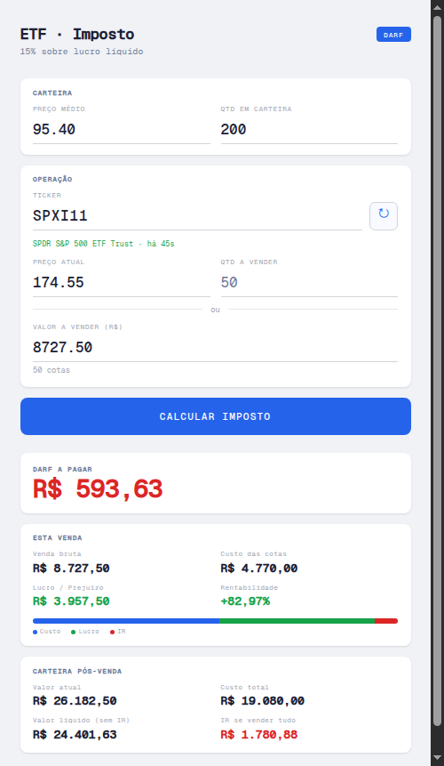

# ETF · Imposto

Calculadora de imposto de renda para vendas de ETFs na bolsa brasileira. Roda inteiramente no browser — sem backend, sem dependências externas além de uma fonte e a API de cotações.



## Funcionalidades

- **Busca de cotação automática** — digite o ticker (ex: `SPXI11`) e clique ↻ ou pressione Enter para preencher o preço atual via [brapi.dev](https://brapi.dev)
- **Tempo desde a última atualização** — o status mostra há quantos segundos/minutos/horas a cotação foi buscada
- **Cálculo do IR** — alíquota de 15% sobre o lucro líquido da venda
- **Gráfico de composição da venda** — barra empilhada mostrando custo, lucro e IR
- **Carteira pós-venda** — valor atual, custo total, valor líquido e IR estimado se vender tudo
- **Persistência local** — todos os campos são salvos no `localStorage` e restaurados ao reabrir

## Como usar

1. Abra `index.html` no browser (ou acesse via GitHub Pages)
2. Preencha **Carteira**: preço médio de compra e quantidade total de cotas
3. No campo **Ticker**, digite o código do ETF e clique ↻ para buscar a cotação atual
4. Informe a **Qtd a vender** ou o **Valor a vender**
5. Clique em **Calcular Imposto**

## Desenvolvimento

Projeto de arquivo único (`index.html`). Sem build, sem dependências, sem node_modules.

```bash
# clonar e abrir
git clone https://github.com/emanuel36/calculadoraIrETF.git
cd calculadoraIrETF
open index.html   # macOS
xdg-open index.html  # Linux
```

## Licença

MIT
